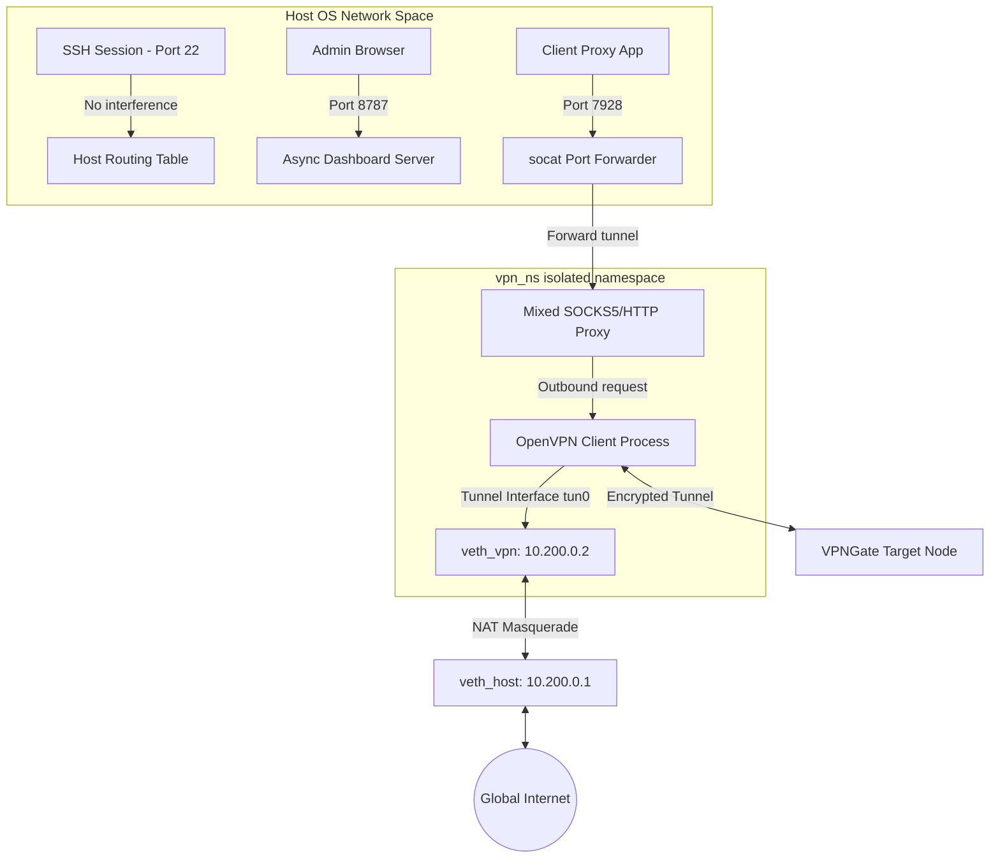

# AetherGate Pro 🌌

AetherGate Pro is an enterprise-grade, high-availability VPN & Proxy Gateway manager designed to run on Linux Virtual Private Servers (VPS). Built by and for proxy network engineers, it solves the notorious issue of SSH disconnection and routing conflicts commonly experienced when running VPN gateways directly on VPS host interfaces.

By isolating all VPN activity inside a dedicated Linux **Network Namespace (`netns`)** and routing proxy traffic via an asynchronous single-port mixed protocol (SOCKS5/HTTP) server, AetherGate Pro provides a seamless, self-healing proxy gateway with a gorgeous glassmorphic dashboard.

---

## 🚀 Key Features

* **Network Namespace Isolation (`netns`)**: Restricted default routing within `vpn_ns` namespace prevents host interface pollution. Say goodbye to SSH drops and disconnected VPS sessions!
* **Mixed Protocol Single-Port Proxy**: Auto-sniffs incoming client connections on port `7928` to serve both **SOCKS5** and **HTTP** protocols on a single port.
* **Auto-Geolocation & Scamalytics Fraud Score Filtering**: Concurrently scrapes VPNGate, performs latency pinging, runs IP geolocations, and checks Scamalytics fraud risks. Hides nodes with a fraud score $\ge 10$ to guarantee pure residential/mobile outbound traffic.
* **Modern Web Dashboard**: A futuristic, glassmorphic dark-themed control center featuring mouse spotlight tracking, real-time diagnostic consoles, auto-refreshing connection tables, and lock settings.
* **Watchdog Self-Healing**: Automatically monitors the VPN tunnel. If a node fails or latency spikes, the background watchdog triggers auto-reconnection/failover.
* **Systemd Daemon Integration**: Designed to run as a persistent system service that auto-starts on system boot.

---

## 🛠️ Architecture Overview



---

## 📥 VPS Deployment Guide

This guide describes how to deploy **AetherGate Pro** on a clean Linux VPS (Ubuntu 20.04/22.04+ or Debian 11+ recommended).

### 1. Prerequisites
Ensure you have root access to your VPS. Connect via SSH:
```bash
ssh root@your_vps_ip
```

### 2. Copy Codebase to VPS
You can clone this repository to your VPS directory (e.g., `/tmp/aethergate-pro`):
```bash
git clone https://github.com/your-username/aethergate-pro.git /tmp/aethergate-pro
```

### 3. Run the Automated Installer
AetherGate Pro includes an automated shell installer that takes care of system package dependency resolution, namespace link setups, iptables rules, credential migrations, and systemd service generation.

Simply navigate to the folder and run:
```bash
cd /tmp/aethergate-pro
sudo bash install.sh
```

**What the installer does:**
1. Installs system packages: `openvpn`, `socat`, `python3`, `iptables`.
2. Cleanly stops any conflicting older proxy daemons.
3. Places the codebase into the target production directory `/opt/vpngate-pro/`.
4. Migrates existing credentials (`/opt/aimilivpn/vpngate_data/ui_auth.json`) into `/opt/vpngate-pro/vpngate_data/config.json` if present.
5. Sets up persistent IP forwarding (`sysctl`).
6. Configures and registers the `vpngate-pro.service` systemd service.
7. Automatically launches the service.

### 4. Verify the Installation
Check that the AetherGate systemd service is active:
```bash
sudo systemctl status vpngate-pro
```

You should see output indicating the service is `active (running)`.

---

## 🖥️ Usage & Access

### 1. Web Dashboard
After successful installation, the Web Dashboard will be exposed at:
* **URL**: `http://<YOUR_VPS_IP>:8787/<SECRET_PATH>/`
  *(Note: The `<SECRET_PATH>` is generated on first startup. You can read or customize it in the config file).*
* **Default Credentials**:
  * **Username**: `admin`
  * **Password**: A random password stored in `/opt/vpngate-pro/vpngate_data/config.json` on first startup (or migrated from your old installation).

### 2. Connecting to Proxy
Set up your local browser (e.g., SwitchyOmega) or system client to use the Mixed Proxy:
* **Proxy Address**: `<YOUR_VPS_IP>`
* **Proxy Port**: `7928`
* **Supported Protocols**: **SOCKS5** (recommended) or **HTTP** (both listen on `7928` simultaneously).

---

## ⚙️ Advanced Customization

You can manually tweak settings in `/opt/vpngate-pro/vpngate_data/config.json`:
```json
{
  "username": "admin",
  "password": "your_secure_password",
  "secret_path": "your_dashboard_url_token",
  "ui_host": "0.0.0.0",
  "ui_port": 8787,
  "proxy_host": "127.0.0.1",
  "proxy_port": 7928,
  "routing_mode": "auto",
  "force_country": "",
  "connection_enabled": false,
  "fixed_node_id": "",
  "scamalytics_threshold": 10
}
```
*Remember to run `sudo systemctl restart vpngate-pro` after modifying the configuration manually.*

---

## 🗃️ Management Commands

```bash
# Restart the gateway and cleanly recreate namespace/forwarding rules
sudo systemctl restart vpngate-pro

# Stop the gateway and tear down network namespaces
sudo systemctl stop vpngate-pro

# View live system logs and connection states
sudo journalctl -u vpngate-pro -f --no-pager
```

---

## ⚖️ License
This project is open-source and licensed under the MIT License. Feel free to fork, contribute, and open issues.
