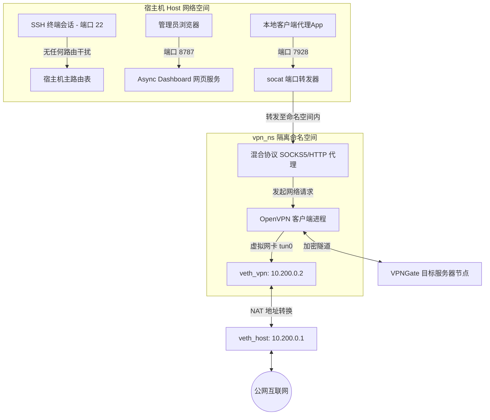

# AetherGate Pro 🌌 (中文版)

[English Version](README.md)

AetherGate Pro 是一款专为 Linux 虚拟专用服务器（VPS）设计的高性能、高可用 VPN 与代理网关管理器。它专门解决在 VPS 物理网卡接口上直接运行 VPN 网关时常见的 SSH 断开连接以及路由冲突等棘手问题。

通过在独立的 Linux **网络命名空间 (`netns`)** 中隔离所有 VPN 流量，并通过异步单端口混合协议（SOCKS5/HTTP）代理服务器转发流量，AetherGate Pro 带来了一个零 SSH 断连、支持故障自愈且界面美观的网关。

---

## 🚀 核心特性

* **网络命名空间隔离 (`netns`)**：将 VPN 连接和路由严格限制在 `vpn_ns` 命名空间中，不污染宿主机网络。**彻底告别运行 VPN 导致 VPS 终端断开/失联的尴尬！**
* **单端口混合协议代理**：在端口 `7928` 上自动识别传入的客户端流量，**单个端口同时支持 SOCKS5 和 HTTP 两种协议**。
* **节点自动抓取与欺诈分过滤**：并发抓取 VPNGate 节点，进行延迟测试、地理位置解析并查询 Scamalytics 欺诈风险得分。自动隐藏欺诈分 $\ge 10$ 的节点，确保出口 IP 的住宅/移动网络纯度。
* **高颜值 Web 控制台**：基于现代化暗黑玻璃化（Glassmorphism）风格设计，支持鼠标微光追踪动画、实时系统日志流输出（`system_diagnostics.sh`）、候选服务器状态表及网关选路模式锁定。
* **看门狗故障自愈**：后台守护进程自动监控 VPN 隧道。如果当前节点失效、连接超时或延迟激增，将自动执行**无感 NAT 切换（NAT Masquerade Replace）并重连到备用节点**。
* **Systemd 系统服务集成**：作为持久化系统服务运行，支持随 VPS 开机自动启动。

---

## 🛠️ 系统架构图



---

## 📥 VPS 部署指南

本指南将帮助您在干净的 Linux VPS 上快速部署 **AetherGate Pro**（推荐使用 Ubuntu 20.04/22.04+ 或 Debian 11+）。

### 方式 1：快捷一键安装（推荐，适合小白）

只需在您的 VPS 上粘贴并运行以下一键部署脚本：

```bash
curl -sSL https://raw.githubusercontent.com/JFGAtlas/aethergate-pro/main/install_vps.sh | bash
```

> [!TIP]
> **一键脚本将为您自动处理以下步骤**：
> 1. 检测并自动安装 `git` 命令。
> 2. 自动拉取最新的 AetherGate Pro 仓库源码。
> 3. 运行配置并设置开机启动，输出管理面板链接与端口。

---

### 方式 2：手动克隆安装

如果您希望手动把控部署的细节，请按以下步骤操作：

#### 1. 前提条件
拥有您的 VPS 的 `root` 权限。通过 SSH 连接到您的 VPS：
```bash
ssh root@your_vps_ip
```

#### 2. 下载源码至临时目录
```bash
git clone https://github.com/JFGAtlas/aethergate-pro.git /tmp/aethergate-pro
```

#### 3. 执行安装脚本
```bash
cd /tmp/aethergate-pro
sudo bash install.sh
```

**安装脚本将自动执行以下操作**：
1. 安装系统依赖：`openvpn`、`socat`、`python3-pip`、`ca-certificates` 等。
2. 自动配置 SOCKS5/HTTP Python 依赖库（`fastapi`、`httpx`、`uvloop`、`websockets`）。
3. 安全停止并清理任何旧版本的冲突代理进程。
4. 将核心代码部署到生产目录 `/opt/vpngate-pro/`。
5. 开启内核 IP 转发功能（`sysctl`），配置持久化端口转发和 veth 虚拟网卡链路。
6. 注册并启动 `vpngate-pro.service` 服务。

#### 4. 验证服务运行状态
```bash
sudo systemctl status vpngate-pro
```
如果看到 `Active: active (running)`，说明服务已启动并运行。

---

## 🖥️ 访问与配置

### 1. 管理网页控制台
成功安装后，控制台会在终端中打印出入口。默认的访问方式为：
* **URL**: `http://<您的_VPS_IP>:8787/<SECRET_PATH>/`
  *(注意： `<SECRET_PATH>` 是首次启动时生成的安全路径随机口令，可在配置文件中查看或修改，这可以防止后台被恶意扫描)*
* **默认凭证**：
  * **用户名 (Username)**: `admin`
  * **密码 (Password)**: 在首次安装时生成并写入配置文件 `/opt/vpngate-pro/vpngate_data/config.json` 中的随机高强度密码。

### 2. 接入并使用代理
在您的本地客户端（如 SwitchyOmega 插件、v2rayN、Clash 等）中添加网关代理：
* **代理服务器地址**: `<您的_VPS_IP>`
* **代理端口**: `7928`
* **支持协议**: **SOCKS5**（推荐）或 **HTTP**（均在 `7928` 端口同时监听并自动识别）。

---

## ⚙️ 配置文件说明 (`config.json`)

您可以根据需求手动修改 `/opt/vpngate-pro/vpngate_data/config.json`：
```json
{
  "username": "admin",
  "password": "your_secure_password",
  "secret_path": "your_dashboard_url_token",
  "ui_host": "0.0.0.0",
  "ui_port": 8787,
  "proxy_host": "127.0.0.1",
  "proxy_port": 7928,
  "routing_mode": "auto",
  "force_country": "",
  "connection_enabled": false,
  "fixed_node_id": "",
  "scamalytics_threshold": 10
}
```
*提示：手动修改完文件后，需要运行 `sudo systemctl restart vpngate-pro` 才能生效。*

---

## 🗃️ 常用系统管理命令

```bash
# 重启网关，这会干净地重建网络命名空间、虚拟链路和转发规则
sudo systemctl restart vpngate-pro

# 停止网关，这会自动拆除所有虚拟隔离网络和 NAT 规则，恢复系统初始状态
sudo systemctl stop vpngate-pro

# 查看网关实时运行日志，包括 OpenVPN 的连接细节和看门狗的探针信息
sudo journalctl -u vpngate-pro -f --no-pager
```

---

## ⚖️ 开源协议
本仓库基于 MIT 许可协议开源。您可以自由地复制、修改和分发。欢迎提交 Issue 和 Pull Request！
